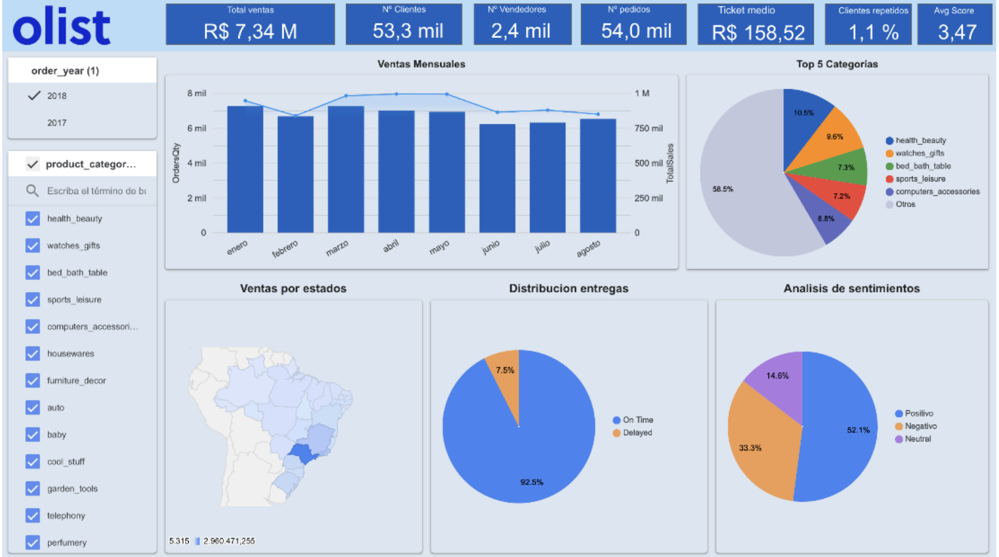

# Olist E-commerce Analytics

Data analysis project on Olist, a Brazilian e-commerce platform, focused on customer behavior, sales performance, logistics efficiency, and business insights.

---

## 📌 Project Overview

This project analyzes data from Olist, a Brazilian e-commerce marketplace that connects small and medium-sized businesses with major online sales channels.

The analysis covers the period 2017–2018 and aims to understand the platform’s commercial and operational behavior by analyzing sales performance, order dynamics, logistics efficiency, and customer satisfaction.

The analysis focuses on identifying patterns in sales evolution, delayed and canceled orders, and their impact on customer experience.

It also explores product category performance, the role of sellers in customer satisfaction, and the relationship between delivery performance and reviews.

Finally, a sentiment analysis model using Hugging Face was applied to classify customer reviews, and key insights were summarized in an interactive dashboard to support business decision-making.

---

## 🎯 Objectives

The main objective of this project is to analyze patterns behind order delays and their relationship with sales volume, product categories, and customer reviews.

Based on this, the goal is to identify actionable strategies to improve logistics efficiency, enhance customer experience, and strengthen sales and customer retention.

---

## 📊 Dataset

The analysis is based on multiple datasets from the Olist platform:

- olist_customers_dataset  
- olist_geolocation_dataset  
- olist_order_items_dataset  
- olist_order_payments_dataset  
- olist_order_reviews_dataset  
- olist_orders_dataset  
- olist_products_dataset  
- olist_sellers_dataset  
- product_category_name_translation  

### 🔗 Key Relationships

- `customer_id` → links customers and orders  
- `order_id` → central key across orders, items, payments, and reviews  
- `product_id` → links products and order items  
- `seller_id` → identifies the seller per order item  

---

## 🛠️ Methodology & Tools

### 🧹 Data Cleaning & Transformation
Data was cleaned and structured using Python, handling missing values, standardizing formats, and preparing datasets for analysis.

**Tools used:**
- Python  
- Pandas  
- NumPy  
- SQL  
- Jupyter Notebook  

---

### 🔍 Analysis & Insights
Exploratory data analysis was performed to identify patterns in sales, customers, delivery performance, and product categories.

**Tools used:**
- Python  
- Pandas  
- NumPy  
- Matplotlib  
- SQL  
- Jupyter Notebook  

---

### 📊 Data Visualization
Interactive dashboards were created to communicate key business insights and KPIs.

**Tools used:**
- Looker Studio  

## 📊 Dashboard & Data Preparation

Data was prepared and transformed using Python to build structured datasets for visualization in Looker Studio.

The final results are presented in an interactive dashboard showing key business KPIs such as sales performance, delivery metrics, and customer satisfaction.

Key visualization from the project:

---

## 🔍 Exploratory Data Analysis (EDA)

The EDA focused on understanding sales performance, customer behavior, logistics efficiency, and order status distribution.

### 📦 Sales Analysis
- Sales evolution over time  
- Revenue and order trends  
- Ticket average evolution  
- Sales distribution by product category  

---

### 🚚 Order Status Analysis
- Distribution of order statuses (delivered, canceled, delayed, unavailable)  
- Focus on delayed orders and their impact  
- Relationship between sellers and delivery performance  
- Product characteristics influencing delays  

---

### ⏱️ Delivery Performance
- Delivery time analysis  
- Relationship between delivery time and review scores  
- Impact of delays on customer satisfaction  

---

### 🛍️ Product & Category Analysis
- Identification of top-performing categories  
- Categories most affected by delays  
- Sales vs logistics performance by category  

---

### 👤 Customer Analysis
- Customer segmentation  
- Ticket average per customer  
- Customer evolution over time  
- Repeat customer behavior and review scores  

---

## 🧠 Sentiment Analysis (Hugging Face)

A sentiment analysis was performed using Hugging Face NLP models to analyze customer reviews.

---

### ⚖️ Model vs User Ratings
Model predictions were compared with user ratings, showing strong alignment, although the model is slightly more conservative.

---

### 📊 Rating Distribution
- Ratings grouped into negative, neutral, and positive  
- Majority of reviews are positive  
- Negative reviews represent a small proportion  

---

### 🚚 Delivery vs Sentiment
- Delayed orders are more likely to generate negative sentiment  
- However, product quality often compensates for delivery issues  

---

### 🔗 Correlation Analysis
No strong correlation was found between delivery time and review scores, suggesting other factors influence satisfaction.

---

### 🛍️ Category Insights
Some categories show consistently high satisfaction, while others (e.g. furniture, decor, stationery) show more variability.

---

## 💡 Key Findings

- Sales increased by ~20% between 2017 and 2018, driven mainly by order volume  
- Growth is volume-based, not driven by ticket size  
- Delays increased with growth, highlighting logistics pressure  
- Only ~8% of orders were delayed, but they strongly impact reviews  
- A significant portion of positive reviews still come from delayed orders  
- Seller performance is a key driver of customer satisfaction  
- Only ~42% of reviews include written feedback  

---

## 🚀 Conclusions

- Olist shows strong and sustained business growth  
- Logistics did not scale at the same pace as sales  
- Customer satisfaction depends more on product quality than delivery speed  
- Seller-level performance is critical to customer experience  
- There is clear room for optimization in logistics and demand forecasting  

---

## 💡 Strategic Recommendations

### 🛒 Sales Strategy
- Plan campaigns around peak demand periods  
- Focus on top-performing categories  
- Implement cross-selling and loyalty strategies  
- Increase geographic seller distribution  

---

### 🚚 Logistics
- Improve stock synchronization with sellers  
- Implement predictive demand models  
- Reduce delayed orders through proactive monitoring  
- Optimize handling of high-risk delivery periods  

---

### 💬 Customer Experience
- Use sentiment analysis to identify recurring issues  
- Improve low-performing product categories  
- Increase post-purchase communication  
- Encourage feedback collection  

---

### 👥 Customer Retention
- Reactivate inactive customers  
- Promote repeat purchases through personalization  
- Improve customer engagement after delivery  

---

## 📌 Notes

- Developed as part of a Master’s in Data Science & AI  
- All notebooks, presentation materials, and Looker Studio dashboards are in Spanish, as the project was developed during a Spanish-taught Master’s program  
- Focused on business-oriented data analysis and actionable insights  
